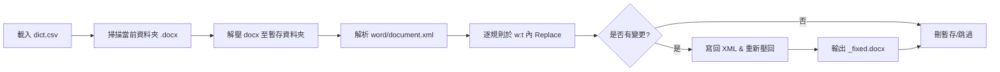

# README.md

> 批量替換 Word（.docx）文件內文字的小工具；以 `dict.csv` 定義「錯字→正字」對照，批次處理目前資料夾內的檔案並輸出 `*_fixed.docx`。

## 特色

* **零安裝**：純 PowerShell + 內建壓縮/Xml 類別（Windows 10+ 可直接用）。
* **批次處理**：同資料夾所有 `.docx`（排除 `*_fixed.docx`）。
* **可讀字典**：以 CSV 管理替換規則，版本控管容易。
* **安全設計**：輸出另存 `_fixed` 後綴，不覆蓋原檔。

## 適用情境

* 法遵/行銷稿大量排錯字、統一用詞（如品牌命名、金融名詞標準化）。
* 初稿產出後，最後一哩統一校對。

## 系統需求

* Windows 10 或更新版（含 PowerShell 5+）。

## 快速開始

1. 下載或 `git clone` 本專案到本機資料夾。
2. 準備 `dict.csv`，欄位：`wrong,right`，例如：

   ```csv
   wrong,right
   Micro Soft,Microsoft
   台積電(股),台積電
   cat,cat（動物）
   ```
3. 將要處理的 `.docx` 放在同一資料夾（避免含有 `*_fixed.docx`）。
4. 直接執行 `run.bat`（或在 PowerShell 執行 `docx_replace_v2_debug.ps1`）。
5. 處理完成後，生成 `<原檔名>_fixed.docx`。

## 使用流程



## 指令與檔案

* `docx_replace_v2_debug.ps1`：主腳本（解壓→替換→壓回）。
* `dict.csv`：替換規則表，需含標題列 `wrong,right`。
* `run.bat`：雙擊執行便利腳本。

## 注意事項（必讀）

* **跨節點文字無法替換**：Word 可能將一個詞切在多個 `<w:t>`/`<w:r>`。本工具只在「單一 `<w:t>` 內」替換；跨節點將漏網。
* **計數為節點粒度**：輸出統計的數字是「被修改之 `<w:t>` 節點個數」，非實際換字次數總和。
* **只處理主文件**：`word/document.xml`；不含 header/footer、腳註/尾註、批註、圖形文字框等。
* **大小寫/整字匹配**：目前為純 `.Contains().Replace()`；可能誤傷子字串（例如 `cat` → 也影響 `concatenate`）。
* **檔案鎖定**：Word 開啟中或無權限會失敗；請先關閉原檔。
* **自動化環境**：腳本結尾 `pause` 會卡住流程，CI/批次建議移除或自訂參數。

## 範例

* 原文：`本公司名稱為 Micro Soft。`
* 規則：`Micro Soft → Microsoft`
* 結果：`本公司名稱為 Microsoft。`

## Roadmap（規劃）

* [ ] 支援 header/footer、footnotes/endnotes、comments。
* [ ] 支援正則、大小寫忽略、整字匹配選項。
* [ ] 改善跨節點替換（合併連續文字節點或以 Open XML SDK 處理）。
* [ ] 參數化（目錄、遞迴、NoPause、IncludeHeaders 等）。
* [ ] 產出詳細報告（命中規則、實際替換次數、定位）。

## 常見問答（FAQ）

**Q1：為何我看得到的詞沒有被換？**
A：多半因為該詞被分割在多個 `<w:t>/<w:r>`。目前只處理單一節點內的文字。

**Q2：能不能忽略大小寫或只換整個單字？**
A：目前不支援；可用後續 Roadmap 的進階版。

**Q3：macOS 可以跑嗎？**
A：腳本使用 .NET/PowerShell 與 Zip 類別，理論上 PowerShell 7+ 有機會，但未正式測試與支援，建議在 Windows 執行。

**Q4：我想要處理子資料夾內所有檔案？**
A：現行只掃描當前資料夾；可等後續參數化或自行先整理檔案到同一層。

授權：本專案採 MIT License。
